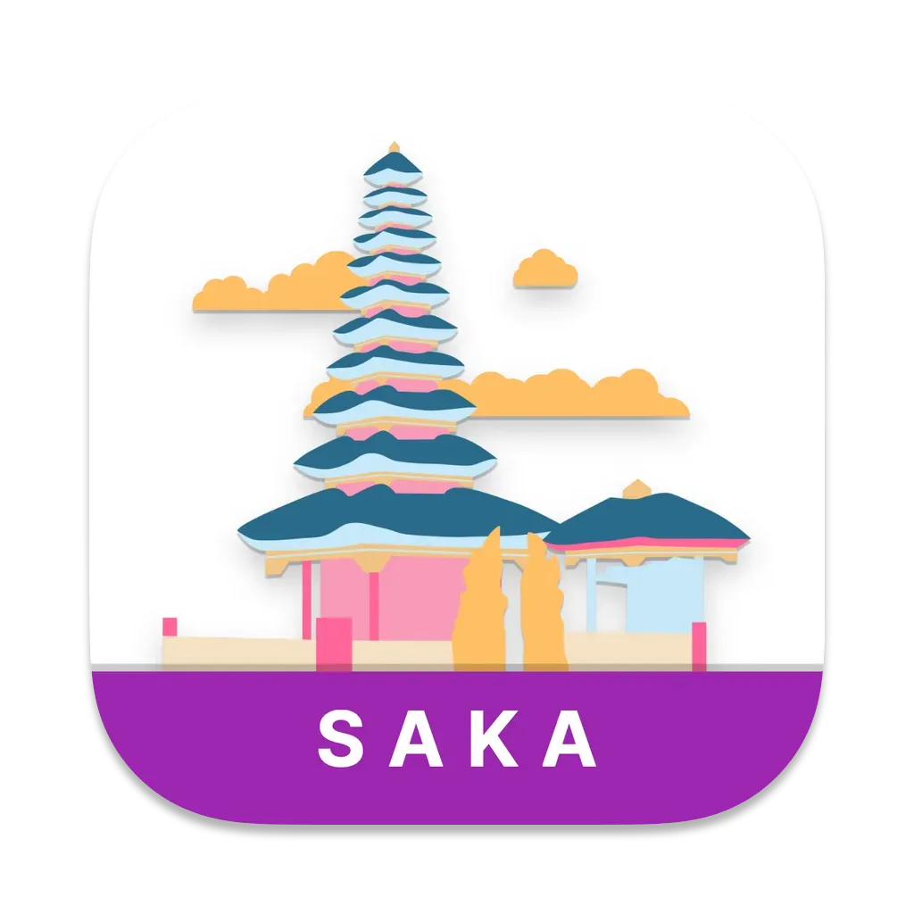
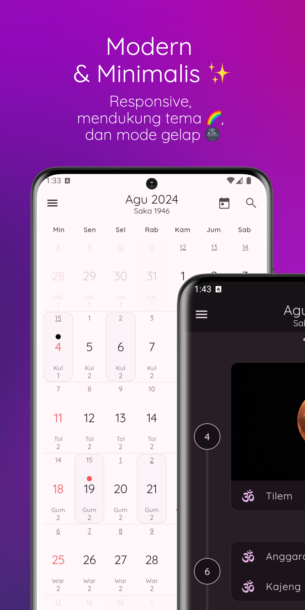
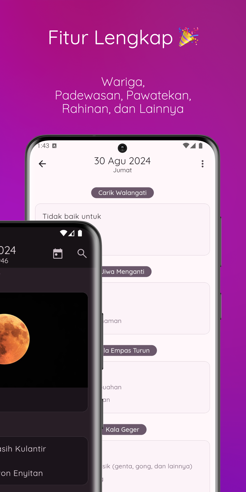
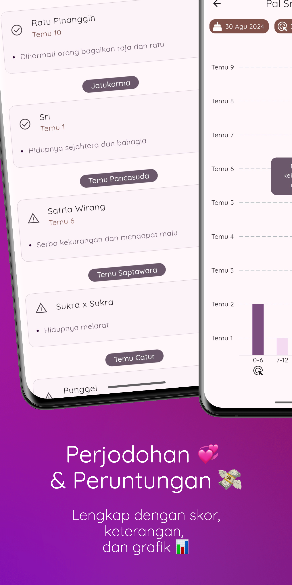
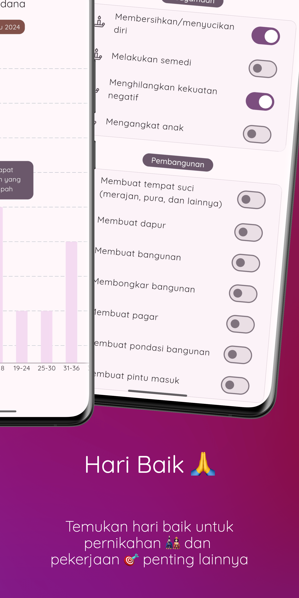
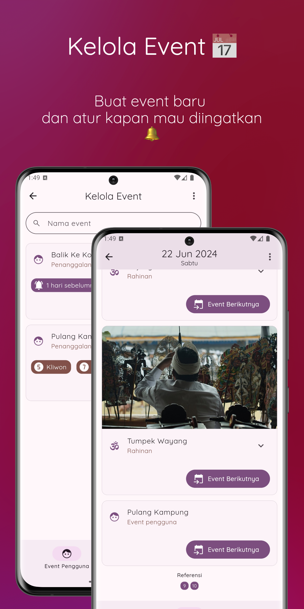
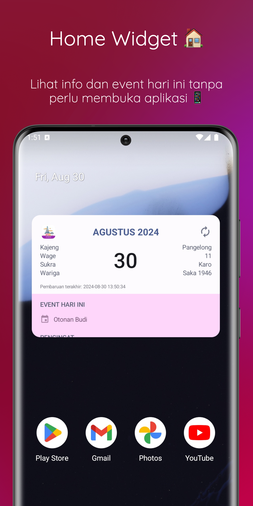

# Kalender Saka Bali

**Om Swastyastu,**

**Kalender Saka Bali** adalah aplikasi yang berfokus untuk memuat informasi mengenai penanggalan Bali yang diharapkan dapat memenuhi kebutuhan pengguna untuk mencari Kalender Bali yang lengkap.

Aplikasi ini jauh dari kata sempurna. Saran dan pertanyaan dapat pengguna kirimkan ke email: peradnya.dinata@gmail.com.

Terima kasih.

**Om Santih, Santih, Santih, Om**

## Fitur

Adapun fitur-fitur dari Kalender Saka Bali adalah sebagai berikut:

### Kalender Bali
Pengguna dapat melihat penanggalan Bali dari dalam format yang minimalis dan informatif. Pengguna pun bisa melihat detail seperti Wariga, Pewatekan, Padewasan, Rahinan, dan lainnya dengan memilih tanggal yang diinginkan.

### Menghitung Perjodohan & Peruntungan
Pengguna dapat menghitung nilai perjodohan (patemon) kedua pasangan berdasarkan 7 Tenung yang tersedia. Selain itu pengguna dapat menghitung nilai peruntungan menggunakan 2 Tenung yang tersedia (Tersedia grafik peruntungan untuk penghitungan Pal Sri Sedana).

### Pencarian Hari Baik
Pengguna dapat melakukan pencarian hari baik (padewasan) pernikahan maupun pekerjaan lainnya dengan cara memasukkan tahun dan kriteria pencarian yang diinginkan.

### Pencarian Tanggal
Pengguna dapat melakukan pencarian tanggal masehi menggunakan kriteria berdasarkan penanggalan Bali maupun daftar Rahinan. Fitur ini sangat berguna untuk mencari tanggal masehi dari Otonan, Piodalan, maupun Rahinan yang diinginkan.

### Kelola, Ekspor, Impor Event
Pengguna dapat menyimpan event seperti otonan atau piodalan dalam bentuk "Event Pengguna", sehingga pengguna dapat menerima notifikasi ketika event tersebut tiba. Selain itu "Event Pengguna" dapat di ekspor maupun di impor, sehingga pengguna tidak akan kehilangan event yang telah disimpan ketika pindah smartphone.

### Bagikan Dokumen sebagai PDF
Pengguna dapat membagikan: detail informasi dari tanggal, hasil pencarian tanggal, serta hasil penghitungan perjodohan & peruntungan kedalam dokumen dalam format PDF dan mengirimkannya kedalam email, cloud, atau aplikasi pengirim pesan.

### App Widget
Pengguna dapat memasukkan "App Widget" pada tampilan utama smartphone, sehingga pengguna dapat melihat informasi penanggalan Bali dan daftar event pada hari ini secara realtime.

### Alarm Tri Sandya (Hanya tersedia untuk Android)
Pengguna dapat mengaktifkan Alarm Tri Sandya baik pagi, siang, maupun sore sehingga pengguna tidak melewatkan waktu Tri Sandya.

### Design Modern, Responsif, dan Mendukung "Offline Mode"
Kalender Saka Bali mendukung: mode terang/gelap, tema berwarna, serta berbagai resolusi layar (phone, tablet, desktop). Selain itu Kalender Saka Bali mendukung "Offline Mode", sehingga aplikasi tetap bisa digunakan walaupun tanpa koneksi internet.

## Tampilan Aplikasi

|  |  |  |  |  |  |
| --- | --- | --- | --- | --- | --- |

## Unduh

|  |  |
| --- | --- |

---

Hak cipta © 2019-2024 Ida Bagus Putu Peradnya Dinata. Semua hak dilindungi.

*Terdaftar di Direktorat Jendral Kekayaan Intelektual (EC00202020643)*